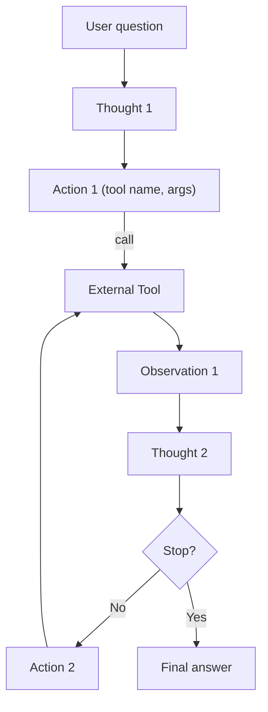

# Agents and the ReAct Framework

## What is an agent (in the LLM field)?

An agent is a system that uses an LLM to choose actions in pursuit of a goal. Instead of producing a single static answer, the agent iteratively plans, calls tools (APIs, databases, calculators, code), observes results, and decides what to do next. The key ingredients are:

- A memory/state (e.g., the running conversation and intermediate results)
- A set of tools the model can call with structured arguments
- A control loop that routes between “think” (LLM) and “act” (tools)

This lets models go beyond recall and free‑form text: they can fetch fresh data, perform precise computations, and decompose tasks.

## ReAct: Reasoning + Acting

ReAct is a simple but powerful pattern where the model alternates between “Thought” (reasoning) and “Action” (tool use), observes the result, and continues until it can answer. You can read the traces as a sequence:

Thought → Action → Observation → Thought → … → Final Answer

### ReAct loop (diagram)

### Why it works

- Makes reasoning explicit and auditable (read the thoughts and actions)
- Encourages step‑wise problem solving and tool use only when needed
- Generalizes to many tasks: search → read → compute → summarize → verify

### Citation

ReAct: Synergizing Reasoning and Acting in Language Models — Yao, Shunyu; Yu, Dian; Zhao, Jeffrey; et al. arXiv:2210.03629. Available at `https://arxiv.org/abs/2210.03629`.

